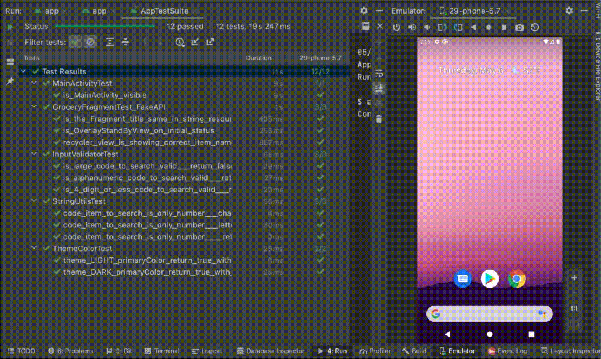
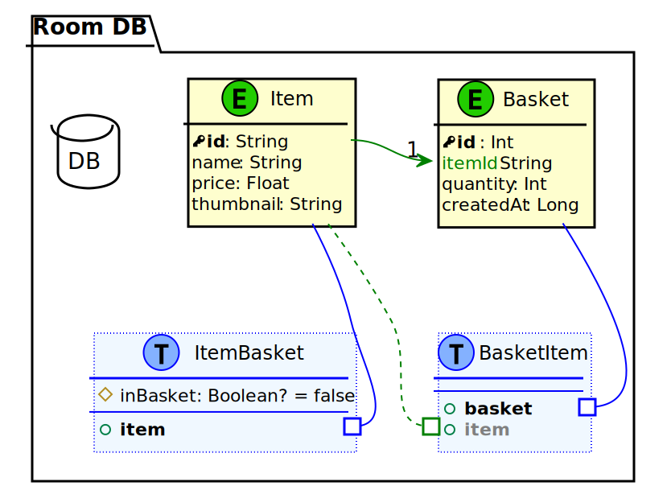
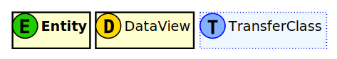
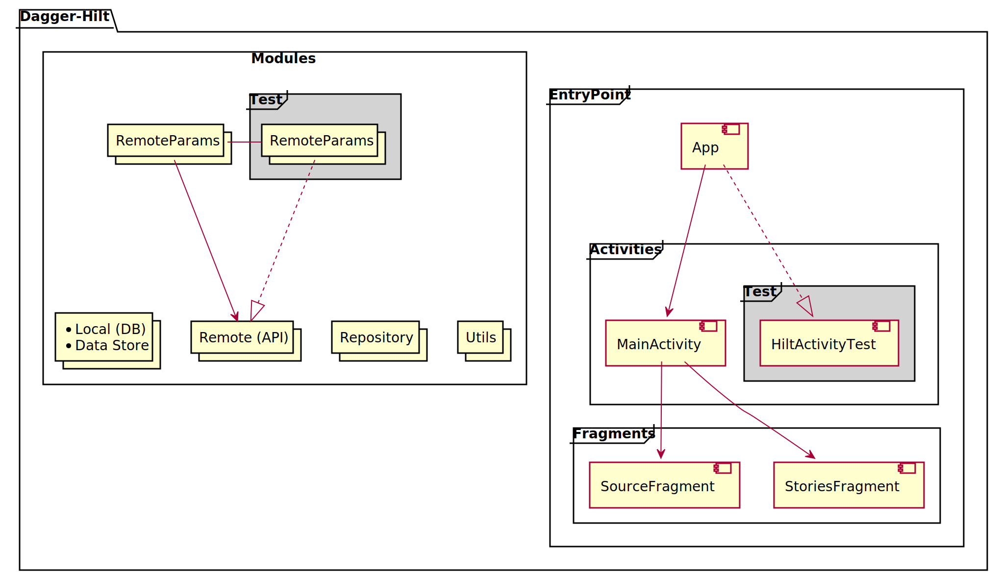

# Project Description
>Customers want the ability to scan items using their phones as they walk around the store, and add them to a virtual basket.
>
>Each item in the store is identified using a QR code. Customers can use their phones camera to scan the QR code, and retrieve the items information, also users can manually enter the items identifier to look the items up.
>
> App's functionalities:
> * Scan QR codes of items and show the information.
> * Manually add item codes
> * Remove items from the virtual basket
> * Calculate total price of items

------------------------

<table>
<tr>
<td>
Unit Test - Integration Test<br/>

</td>
</tr>
<tr>
<td>
Save State handle - kill App on Background<br/>

</td>
</tr>
</table>

------------------------

### MAIN FEATURES
- Kotlin
- Architectural Pattern MVVM
- Dependency Injection with Dagger-Hilt
- Navigation Component
- Flow and StateFlow
- Data persistent with Room DB and DataStore

### IMPLEMENTATIONS
- FragmentFactory
- ViewBinding
- SavedStateHandle
- NavigationSafeArgs
- NetworkBoundResource

### EXTRA FEATURES
- custom view _**"OverlayStandbyView"**_ with viewBinding delegation

### UNIT TEST AND INTEGRATION TEST
- Junit, Espresso
- MockWebServer
- Dagger-Hilt injection test
- Real and Fake http response test
- Espresso Suite test

------------------------
### _*FOLDER STRUCTURE*_

#### _Main - Java:_
```yaml
↳ base: app entry point and constants
↳ data: data source classes
  ↳ local: data classes to map the API responses
     ↳ model: data model classes and Data Access Object (DAO - Room)
  ↳ remote: classes and interfaces of API
     ↳ response: data classes to map the API responses and Data Transfer Object (DTO - Mapper)
↳ di: hilt dependency injection folder, (Local, Remote and Repository modules)
↳ repository: communication middle layer between data sources and viewmodels
↳ ui:
  ↳ _components: custom view, player and ui factories
↳ utils:
  ↳ extensions: kotlin extensions
```

#### _Debug - Java:_
```yaml
* HiltActivityTest: virtual activity to run Fragment scenario test with Dagger-Hilt
```

#### _androidTest - Java:_
Similar structure to the main directory, including only the directories with the classes to be tested
```yaml
* AppTestRunner: custom test instrumentation runner
* AppTestSuite: suite to run all integration test
↳ _components: required classes to run hilt and mockwebserver
```

------------------------

### Room DB

<table>
<tr>
<td>
ER Diagram<br/>

</td>
</tr>
<tr>
<td>

</td>
</tr>
</table>

------------------------

### Dependency Injection - Dagger-Hilt
- _**LocalModule**_: room database and datastore
- _**RemoteModule**_: retrofit and okHttp services \
  ↳ _**RemoteParamsModule**_: baseUrl separately to be overwritten in integration tests
- _**RepositoryModule**_: middle layer injection
- _**UtilsModule**_: Input/Form validator



------------------------

liviolopez@gmail.com